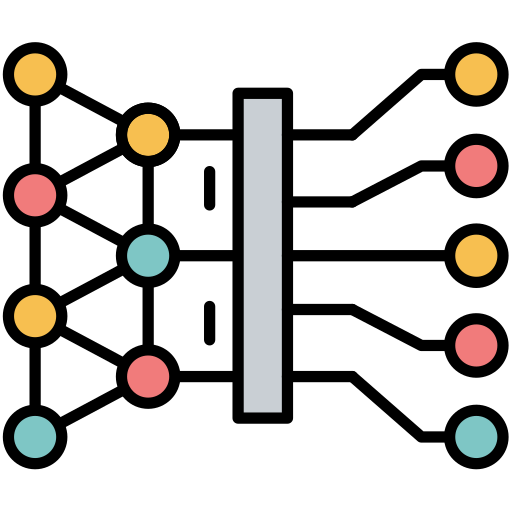

<!-- _class: cover -->
<!-- _paginate: false -->
<!-- _footer: "" -->

# 人工智慧應用開發實務
## Introduction
許智超
<cchsu@mail.nsysu.edu.tw>

---

### About This Course

- 許智超, Chih-Chao Hsu, Ph.D.
<cchsu@mail.nsysu.edu.tw>
- 課程目標：
培養應用人工智慧技術協助開發人工智慧應用系統的能力。
- 計分方法
    - 出席: 10%
    - 作業: 75%
    - 專題: 15%

---

### About This Course

- Static Web Page
- Google Apps Script
- Single Page Application
- Full Stack Web Application

---

<!-- _class: lead -->

## 認識人工智慧

---

<style scoped>
section p { text-align: center; }
</style>

### 你認為什麼是人工智慧？

<br />


---

<style scoped>
section p { text-align: center; }
</style>

### 你認為什麼是人工智慧？


---
<style scoped>
section p { text-align: center; }
</style>

### 你認為什麼是人工智慧？

<br />


---

### Alan Turing


- 艾倫圖靈，1912-1954
- 英國電腦科學家、數學家、邏輯學家、密碼分析學家和理論生物學家。
- 被譽為電腦科學與人工智慧之父。


---

<!-- _class: lead -->


---

<!-- _class: lead -->


---

<!-- _class: lead -->


---

<!-- _class: lead -->


---

<style scoped>
section p { text-align: center; font-size: 0.7em; }
</style>

### 圖靈測試通過了嗎？


[2個AI混入人類聊天群，能成功嗎？ 【沉浸視角】](https://www.youtube.com/watch?v=ULhJL6raKco)

---

<style scoped>
section p { text-align: center; font-size: 0.7em; }
</style>

### 圖靈測試通過了嗎？


[GPT-4.5 通過圖靈測試了？AI 真的能騙過人類了嗎？](https://vocus.cc/article/67eea440fd897800018571a7)

---

### 什麼是人工智慧？

> 希望電腦或機器能夠像人類一樣，能夠學習、推理、理解語言和圖像，並做出判斷、決策、解決問題或完成各種任務。

---

<style scoped>
section p { text-align: center; font-size: 0.7em; }
</style>

### 人工智慧發展歷程


---

<style scoped>
section p { text-align: center; font-size: 0.7em; }
</style>

### 人工智慧發展歷程


---

<style scoped>
section p { text-align: center; font-size: 0.7em; }
</style>

### 人工智慧發展歷程


---

<style scoped>
section p { text-align: center; font-size: 0.7em; }
</style>

### 人工智慧、機器學習、深度學習、生成式AI 的關係


---

### 機器學習及深度學習的任務


---

### 什麼是機器學習？

> 機器學習是一種人工智慧的分支，讓電腦透過 **資料** **學習** 規律，並利用這些規律進行預測或決策，而不需要明確的程式指令。

<br />


---

<style scoped>
section p { text-align: center; font-size: 0.7em; }
</style>

### 舉例說明

<br />


---

<!-- _class: lead -->


---

<!-- _class: lead -->


---

<br />


---

<!-- _class: section-page -->

### 演算法



---

<!-- _class: section-page -->


---

<!-- _class: section-page -->

### 什麼是ChatGPT？

---

<!-- _class: section-page -->

### 大型語言模型（LLM）
### Large Language Model

---

### 生成式 AI（Generative AI）

> 藉由大量**數據**的**學習**，產生複雜而結構化內容的技術

<br />


---

<style scoped>
section p { text-align: center; font-size: 0.7em; }
</style>

### 有那些生成式AI？


---

<!-- _class: section-page -->

### 生成式 AI 怎麼產生內容？


---

### 語言模型就是在做文字接龍


---

### 語言模型就是在做文字接龍


---

### 語言模型就是在做文字接龍


---

### 只是文字接龍有什麼了不起？

- 中文常用字是 $3500$，我們算 $1000$ 字就好
- 如果要產出 $100$ 字
- 就有 $1000^{100}$ 種可能性，也就是 $10^{300}$ 種可能性
- 宇宙原子總數才 $10^{82}$

---

<style scoped>
section p { text-align: center; font-size: 0.7em; }
</style>

### 圖形怎麼做文字接龍？


---

<style scoped>
section p { text-align: center; font-size: 0.7em; }
</style>

### 圖形怎麼做文字接龍？


---

<style scoped>
section p { text-align: center; font-size: 0.7em; }
</style>

### 聲音怎麼做文字接龍？


---

<style scoped>
section p { text-align: center; font-size: 0.7em; }
</style>

### 聲音怎麼做文字接龍？


---

### 文字接龍的基本單位 - Token

在化學世界裡，Atom 為最小的單位
在生成式AI裡，Token 是最小的單位
什麼是 Token？

---

### 文字接龍的基本單位 - Token

在化學世界裡，Atom 為最小的單位
在生成式AI裡，Token 是最小的單位
什麼是 Token？


---

<!-- _class: section-page -->

### 大型語言模型的先天缺陷

---

<style scoped>
section p { text-align: center; font-size: 1.25em; }
</style>

### 既然是文字接龍，猜猜它不擅長什麼？

不善邏輯推理


---

<style scoped>
section p { text-align: center; font-size: 0.7em; }
</style>

### 既然是文字接龍，猜猜它不擅長什麼？


---

<style scoped>
section p { text-align: center; font-size: 1.25em; }
</style>

### 既然是文字接龍，猜猜它不擅長什麼？

缺乏即時性資料


---

<style scoped>
section p { text-align: center; font-size: 0.7em; }
</style>

### 既然是文字接龍，猜猜它不擅長什麼？


今年2026年NBA總冠軍是紐約尼克隊

---

<style scoped>
section p { text-align: center; font-size: 1.25em; }
</style>

### 既然是文字接龍，猜猜它不擅長什麼？

缺少專業或客製化內容


---

<style scoped>
section p { text-align: center; font-size: 0.7em; }
</style>

### 既然是文字接龍，猜猜它不擅長什麼？


---

<style scoped>
section p { text-align: center; font-size: 1.25em; }
</style>

### 既然是文字接龍，猜猜它不擅長什麼？

不懂幽默


---

<style scoped>
section p { text-align: center; font-size: 0.7em; }
</style>

### 既然是文字接龍，猜猜它不擅長什麼？


---

<style scoped>
section p { text-align: center; font-size: 1.25em; }
</style>

### 既然是文字接龍，猜猜它不擅長什麼？

無自我意識


---

<style scoped>
section p { text-align: center; font-size: 0.7em; }
</style>

### 既然是文字接龍，猜猜它不擅長什麼？


---

<style scoped>
section p { text-align: center; font-size: 0.7em; }
</style>

### 不擅長怎麼辦？


人類沒有工具，一無是處。<br/>
人類有了工具，無所不能。<br/>
-Thomas Carlyle

---

<style scoped>
section p { text-align: center; font-size: 0.7em; }
</style>

### 不擅長怎麼辦？


---

<style scoped>
section p { text-align: center; font-size: 0.7em; }
</style>

### 不擅長怎麼辦？


---

<style scoped>
section p { text-align: center; font-size: 0.7em; }
</style>

### AI 怎麼使用工具？


---

<style scoped>
section p { text-align: center; font-size: 0.7em; }
</style>

### 不擅長怎麼辦？


---

<style scoped>
section p { text-align: center; font-size: 0.7em; }
</style>

### 不擅長怎麼辦？


---

<style scoped>
section p { text-align: center; font-size: 0.7em; }
</style>

### 不擅長怎麼辦？


---

<br />


---

<!-- _class: section-page -->

### 正在竄起的 AI Agent

---

<br />


---

### 什麼是代理式 AI

代理式 AI 能幫你完成一個工作，理解目的，規劃工作事項，需要什麼資料、開啟什麼軟體、處理什麼細節，具備行動的能力

---

### 什麼是代理式 AI

代理式 AI 能幫你完成一個工作，理解目的，規劃工作事項，需要什麼資料、開啟什麼軟體、處理什麼細節，具備行動的能力


---

### 什麼是代理式 AI

代理式 AI 能幫你完成一個工作，理解目的，規劃工作事項，需要什麼資料、開啟什麼軟體、處理什麼細節，具備行動的能力


---

<style scoped>
section p { text-align: center; font-size: 0.9em; }
</style>

### AI Agent 如何達成任務？

人類給予目標，AI 自己想辦法達成這個目標，需要多步驟、靈活調整計畫


---

### 如果 AI Agent 的任務是「寫程式」？

- 目標：完成一個功能、修好一個 bug
- 工具：讀寫檔案、執行終端機指令、跑測試、查文件...
- 那麼「AI 能不能自主規劃、使用這些工具完成任務」，就是軟體工程被 AI 改變的關鍵分水嶺

---

### 軟體工程（SE）與 AI 結合的演進階段

1. SE 1.0：智能補全時代（Code Completion）以 2021 年 GitHub Copilot 的問世為代表。此階段 AI 扮演「文字接龍」的角色，主導權完全在開發者手中，AI 僅根據當前游標前後文預測下一行或下一段程式碼，性質類似手機鍵盤的自動選字。

---

### 軟體工程（SE）與 AI 結合的演進階段

2. SE 2.0：對話與 Vibe Coding 時代（Conversational & Vibe Coding）隨著大語言模型（LLM）推理能力突破，Andrej Karpathy 於 2025 年初提出「Vibe Coding」（憑感覺程式設計）一詞。開發者不再逐行編寫或仔細閱讀程式碼，而是透過自然語言提示詞向 AI 描述需求，直接採納生成的程式碼，只要 Demo 可以在本地運作即可。這種模式極大地降低了開發門檻，但產出的程式碼常因缺乏架構審查與測試驗證，呈現高技術債與脆弱性。

---

### 軟體工程（SE）與 AI 結合的演進階段

3. SE 3.0：代理人化軟體工程時代（Agentic Software Engineering）隨著工具呼叫、環境沙盒與長上下文推理技術成熟，軟體開發正式跨入 SE 3.0。AI 系統升級為具備目標導向、自主規劃、跨檔案編輯、終端機命令執行、測試驗證與自我修復能力的全功能代理人。開發者角色從「對話發起者」轉變為「代理人系統架構師（Agentic Engineer）」，確立雙向協同夥伴關係。

---

<!-- _class: section-page -->

### 什麼是人工智慧應用系統？

---

### AI 技術 ≠ AI 應用系統

- **AI 技術**：模型本身的能力，例如 LLM 能理解語言、生成內容
- **AI 應用系統**：把 AI 技術包裝成一個使用者實際能用的系統

<br />

```text
AI 模型／API  +  使用者介面／應用邏輯／資料儲存  =  AI 應用系統
   （大腦）              （身體）
```

---

### AI 應用系統的組成要素

- **使用者介面**：讓人輸入需求、看到結果（網頁、App、聊天視窗...）
- **應用邏輯**：串接使用者輸入與 AI 服務、處理前後流程
- **AI 模型／服務**：實際負責理解、生成、判斷的能力（自建模型或呼叫 API）
- **資料儲存**：紀錄使用者資料、對話紀錄、生成結果等

---

### 常見的 AI 應用系統類型

- 聊天機器人／智慧客服
- 內容生成工具（文案、圖片、影音生成）
- 推薦系統（電商、影音平台）
- 智慧問答／知識檢索（RAG）
- 流程自動化（AI Agent 應用）

---

<style scoped>
section p { text-align: center; font-size: 0.9em; }
</style>

### 這門課要做什麼？

這門課的重點不是「訓練模型」，而是「整合現有 AI 能力，打造使用者真正能用的應用系統」

---

## Web 基礎概念

---

<!-- _class: section-page -->

### 開啟一個網頁時，發生了什麼事？

---

### Client-Server 架構

- **Client（用戶端）**：瀏覽器，負責發出請求、顯示畫面
- **Server（伺服器）**：負責接收請求、處理邏輯、回傳資料

<br />

```text
瀏覽器 (Client)  --- Request  --->  伺服器 (Server)
瀏覽器 (Client)  <--- Response ---  伺服器 (Server)
```

---

### HTTP 協定

> HyperText Transfer Protocol，瀏覽器與伺服器溝通的共同語言

- **Request（請求）**：方法（GET / POST...）、網址、附帶資料
- **Response（回應）**：狀態碼（200 成功 / 404 找不到 / 500 伺服器錯誤）、回傳內容

---

### 網址（URL）的組成

```text
https://www.nsysu.edu.tw/news?id=123
  │        │                │    │
協定     網域(Domain)        路徑  參數(Query)
```

- 協定：如何連線（`https`）
- 網域：伺服器在哪裡（由 DNS 轉換成 IP）
- 路徑／參數：要哪一份資料、附帶什麼條件

---

### 網頁三劍客

- **HTML**：結構（骨架）— 網頁有哪些內容
- **CSS**：樣式（外觀）— 網頁長什麼樣子
- **JavaScript**：行為（互動）— 網頁能做什麼

---

<style scoped>
section p { text-align: center; font-size: 0.9em; }
</style>

### 瀏覽器如何呈現網頁？

下載 HTML → 解析成 DOM 樹 → 套用 CSS 樣式 → 執行 JavaScript → 畫面呈現

---

### 靜態網頁 vs 動態網頁

- **靜態網頁**：內容固定，伺服器只是把現成檔案原封不動送出
- **動態網頁**：內容依請求即時運算、組裝、更新

---

### 前端 vs 後端

- **前端（Front-end）**：使用者看得到、互動的部分，程式碼在瀏覽器端執行
- **後端（Back-end）**：使用者看不到的部分，處理邏輯、資料庫、安全驗證等，程式碼在伺服器端執行

---

### 這學期的網頁開發地圖

| 單元 | 對應概念 |
| --- | --- |
| Static Web Page | 純前端，無伺服器邏輯 |
| Google Apps Script | 借助 Google 平台快速實作後端邏輯 |
| Single Page Application | 前端框架，動態切換畫面、不整頁重新載入 |
| Full Stack Web Application | 前端＋後端＋資料庫，完整系統 |

---

## Git and GitHub

---

<!-- _class: section-page -->

### 申請 GitHub Education

---

### 什麼是 GitHub Education？

- GitHub 提供給學生與教育工作者的免費方案
- 核心是 **GitHub Student Developer Pack**：整合多家廠商的開發工具、雲端服務與免費額度
- 學生可免費使用平常需付費的功能，例如 **GitHub Copilot**、GitHub Pro 帳號等

---

### 申請資格

- 具有在學學生身分（高中以上皆可，含大學、研究所）
- 年滿 13 歲
- 能提供學校核發之在學證明（學校 Email、學生證、註冊證明等）

---

### 如何申請 - 步驟

1. 前往 [education.github.com/pack](https://education.github.com/pack)
2. 使用個人 GitHub 帳號登入（尚未註冊請先建立帳號）
3. 點選 **Get student benefits**
4. 選擇身分為 **Student**
5. 依畫面指示驗證在學身分

---

### 如何驗證在學身分

- 方式一：使用學校核發的 Email 進行驗證（如 `xxx@mail.nsysu.edu.tw`）
- 方式二：上傳在學證明文件（學生證正反面照片、註冊證明等），需清楚顯示姓名、學校名稱與有效日期
- 送出後由 GitHub 自動或人工審核，通常數分鐘至數天不等

---

### 申請小提醒

- 建議先在 GitHub 個人資料填寫真實姓名，並與證明文件一致
- 學生證需能清楚辨識學校名稱與有效期限，避免審核被退件
- 審核未通過可補充文件後重新申請
- 通過後可於 **Settings > Billing and licensing > Education benefits** 查看已啟用的權益

