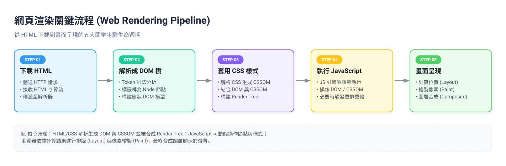
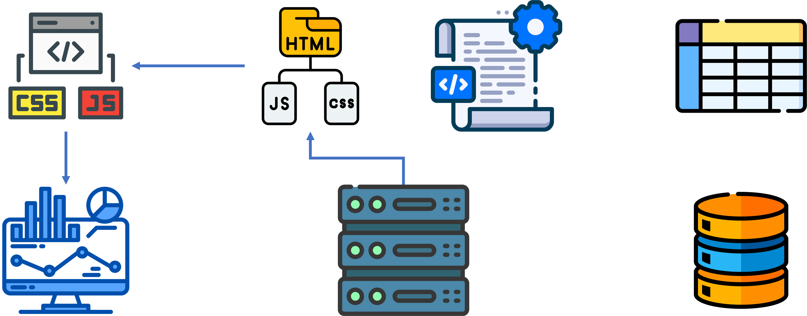
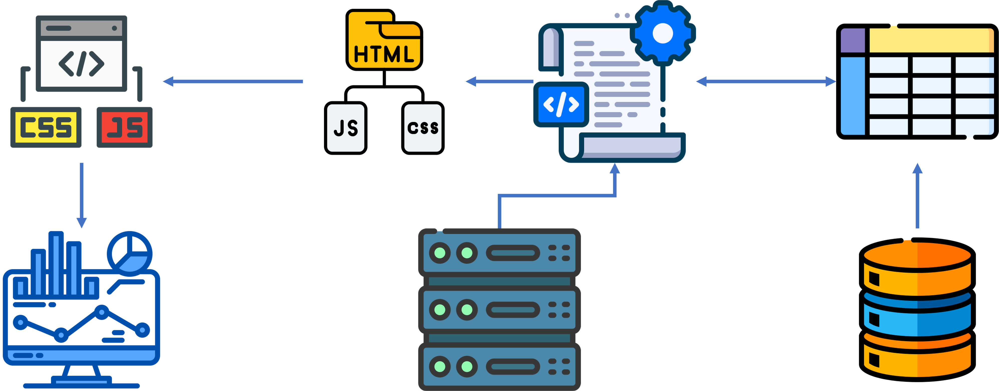
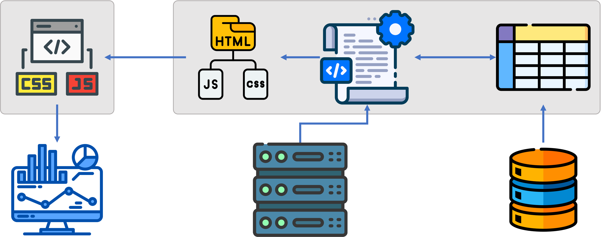
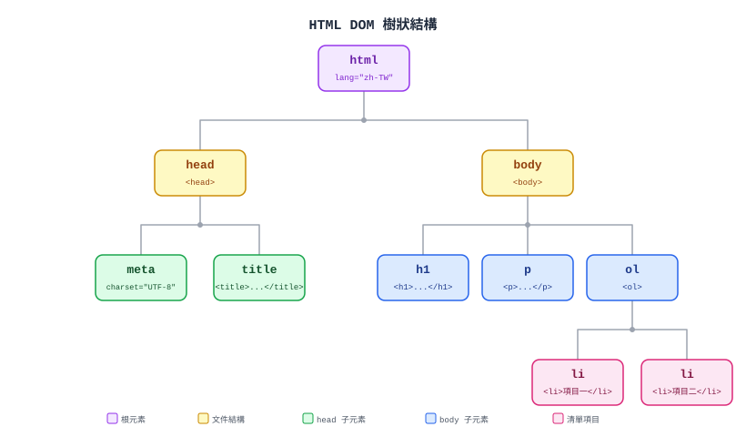
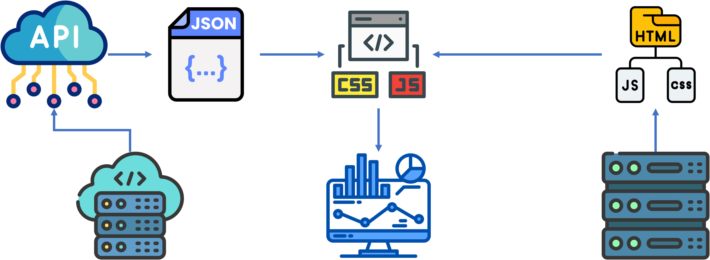
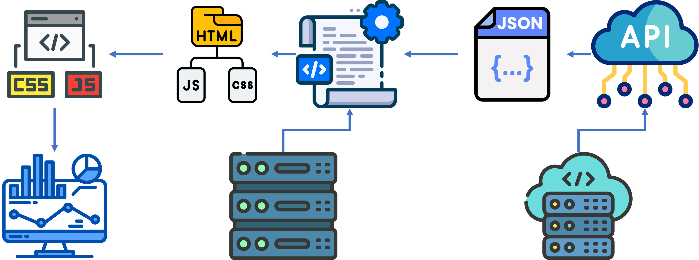

<!-- _class: cover -->
<!-- _paginate: false -->
<!-- _footer: "" -->

# 人工智慧應用開發實務
# Static Web Page

## 許智超

<cchsu@mail.nsysu.edu.tw>

---

<!-- _class: section-page -->

## Web 基礎概念

---

<!-- _class: lead -->

### 開啟一個網頁時，發生了什麼事？

---

### Client-Server 架構

<hr>

- **Client（用戶端）**：瀏覽器，負責發出請求、顯示畫面
- **Server（伺服器）**：負責接收請求、處理邏輯、回傳資料

<br />

```text
瀏覽器 (Client)  --- Request  --->  伺服器 (Server)
瀏覽器 (Client)  <--- Response ---  伺服器 (Server)
```

---

### HTTP 協定

<hr>

> HyperText Transfer Protocol，瀏覽器與伺服器溝通的共同語言

- **Request（請求）**：方法（GET / POST...）、網址、附帶資料
- **Response（回應）**：狀態碼（200 成功 / 404 找不到 / 500 伺服器錯誤）、回傳內容

---

### 網址（URL）的組成

<hr>

```text
https://www.nsysu.edu.tw/news?id=123
  │        │                │    │
協定     網域(Domain)        路徑  參數(Query)
```

- 協定：如何連線（`https`）
- 網域：伺服器在哪裡（由 DNS 轉換成 IP）
- 路徑／參數：要哪一份資料、附帶什麼條件

---

### 網頁三要素

<hr>

- **HTML**：結構（骨架）— 網頁有哪些內容
- **CSS**：樣式（外觀）— 網頁長什麼樣子
- **JavaScript**：行為（互動）— 網頁能做什麼

---

<style scoped>
section p { text-align: center; font-size: 0.9em; }
</style>

### 瀏覽器如何呈現網頁？



---

<style scoped>
section p { text-align: center; }
</style>

### 靜態網頁 vs 動態網頁

- **靜態網頁**：內容固定，伺服器只是把現成檔案原封不動送出
- **動態網頁**：內容依請求即時運算、組裝、更新



---

<style scoped>
section p { text-align: center; }
</style>

### 靜態網頁 vs 動態網頁

- **靜態網頁**：內容固定，伺服器只是把現成檔案原封不動送出
- **動態網頁**：內容依請求即時運算、組裝、更新



---

<style scoped>
section p { text-align: center; }
</style>

### 前端 vs 後端

- **前端（Front-end）**：使用者看得到、互動的部分，程式碼在瀏覽器端執行
- **後端（Back-end）**：使用者看不到的部分，處理邏輯、資料庫、安全驗證等，程式碼在伺服器端執行



---

<!-- _class: lead -->

## 靜態網頁是什麼？

---

<!-- _class: "cols" -->

### 靜態網頁 vs 動態網頁

<hr>

<div class="col-wrap">
<div class="col alt">

**靜態網頁**

- 內容寫死在檔案裡
- 不需要後端伺服器運算
- 檔案直接丟給瀏覽器
- 範例：個人作品集、說明頁

</div>
<div class="col alt">

**動態網頁**

- 內容來自資料庫或 API
- 需要後端語言（PHP、Python…）
- 每次請求都重新產生頁面
- 範例：Facebook、Gmail

</div>
</div>

Notes: 靜態網頁雖然「靜態」，但 JavaScript 仍可讓它有豐富的互動效果！

---

<!-- _class: "cols3" -->

### 網頁三要素：HTML, CSS, Javascript

<hr>


<div class="col-wrap">
<div>

**HTML** / 結構與內容

- 告訴瀏覽器「有什麼內容」
- 標題、段落、圖片、按鈕…
- 像房子的**骨架與牆壁**

</div>
<div>

**CSS** / 樣式與外觀

- 告訴瀏覽器「長什麼樣子」
- 顏色、字型、排版、動畫…
- 像房子的**裝潢與油漆**

</div>
<div>

**JavaScript** / 行為與互動

- 告訴瀏覽器「做什麼事」
- 點擊、計算、更新畫面…
- 像房子的**電路與機關**

</div>
</div>

Notes: 三者分工合作——HTML 定義內容，CSS 負責呈現，JS 處理邏輯。初學時三個都寫在同一個 .html 檔最方便。

---

<style scoped>
pre code { font-size: 0.5em; line-height: 1.15; }
</style>

### 網頁三要素：HTML, CSS, Javascript

<hr>

```html
<!DOCTYPE html>
<html lang="zh-TW">
  <head>
    <meta charset="UTF-8">
    <title>我的網頁</title>
    <style>
      /* CSS 寫在這裡 */
    </style>
  </head>
  <body>
    <!-- HTML 結構寫在這裡 -->

    <script>
      // JavaScript 寫在這裡
    </script>
  </body>
</html>
```

Notes: 實際專案會拆成三個獨立檔案，但初學階段單一檔案更容易上手、方便對照學習。

---

<!-- _class: "section-page" -->

## HTML (HyperText Markup Language)

---

<!-- _class: "cols" -->

### HTML 的由來與發展

<hr>

<div class="col-wrap">
<div class="col alt">

#### 起源

- HyperText Markup Language — 超文字標記語言

- 1989 年，Tim Berners-Lee 在 CERN 提出，語法靈感來自 SGML（文件標記語言）
- 目的：讓科學家能透過網路分享文件

</div>
<div class="col alt">

#### 重要版本里程碑

| 年份 | 版本 |
|------|------|
| 1995 | HTML 2.0（首個正式標準） |
| 1997 | HTML 3.2 / 4.0 |
| 2000 | XHTML 1.0（嚴格語法） |
| 2014 | **HTML5**（現行標準） |

</div>
</div>

Notes: HTML5 由 WHATWG 與 W3C 共同維護，引入了 video、canvas、語意標籤等現代功能。

---

<!-- _class: "cols" -->

<style scoped>
pre code { font-size: 0.6em; line-height: 1.15; }
</style>

### HTML 基本結構

<div class="col-wrap">
<div class="col alt">


```html
<!DOCTYPE html>
<html lang="zh-TW">
  <head>
    <meta charset="UTF-8" />
    <title>我的第一個網頁</title>
  </head>
  <body>
    <h1>哈囉，世界！</h1>
    <p>這是一個段落。</p>
    <ol>
      <li>項目一</li>
      <li>項目二</li>
    </ol>
  </body>
</html>
```

</div>
<div class="col alt">



</div>
</div>

Notes: head 放設定與 CSS；body 放內容；script 擺在 body 底部，確保上方的 HTML 元素已載入完畢。

---

### 常用 HTML 標籤

<hr>

| 標籤 | 用途 | 範例 |
|------|------|------|
| `<h1>`～`<h6>` | 標題（由大到小） | `<h1>大標題</h1>` |
| `<p>` | 段落文字 | `<p>一段話</p>` |
| `<a>` | 超連結 | `<a href="...">點我</a>` |
| `` | 圖片 | `` |
| `<ul>` / `<li>` | 無序清單 | `<ul><li>項目</li></ul>` |
| `<div>` | 區塊容器 | `<div>...</div>` |
| `<button>` | 按鈕 | `<button>送出</button>` |
| `<input>` | 輸入框 | `<input type="text">` |

---

<!-- _class: "section-page" -->

## CSS (Cascading Style Sheets)

---

<style scoped>
pre code { font-size: 0.5em; line-height: 1.15; }
</style>

### CSS 基本語法

<hr>

```css
/* 選擇器 { 屬性: 值; } */
/* tag 選擇器 */
h1 {
  color: #1a73e8;      /* 文字顏色 */
  font-size: 48px;     /* 字體大小 */
  text-align: center;  /* 置中對齊 */
}
/* class 選擇器 */
.highlight {
  background: yellow;
  padding: 8px 16px;
}
/* id 選擇器 */
#main-btn {
  background: #1a73e8;
  color: white;
  border-radius: 8px;
}
```

Notes: 選擇器有三種：tag、.class、#id，優先級依序提高。

---

<!-- _class: "cols" -->

### CSS 常用屬性速查

<hr>

<div class="col-wrap">
<div class="col">

## 文字樣式

- `color` — 文字顏色
- `font-size` — 字體大小
- `font-weight` — 粗體
- `text-align` — 對齊方式
- `line-height` — 行距

</div>
<div class="col alt">

## 盒子模型

- `width / height` — 寬高
- `margin` — 外距
- `padding` — 內距
- `border` — 邊框
- `background` — 背景色
- `border-radius` — 圓角

</div>
</div>

---

<!-- _class: "section-page" -->

## JavaScript

讓網頁動起來的程式語言

---

<!-- _class: "cols" -->

### JavaScript 的故事

<hr>

<div class="col-wrap">
<div>

- **1995 年**
Brendan Eich 在 **10 天**內創造出這門語言
- **原名 Mocha → LiveScript**
為了搭 Java 熱潮，改名為 **JavaScript**
⚠️ 和 Java **完全沒有關係**
- **1997 年**
成為 ECMAScript 國際標準，各瀏覽器開始支援

</div>
<div>

- **2009 年**
Node.js 讓 JavaScript 走出瀏覽器、進入伺服器
- **2015 年（ES6）**
語法大幅現代化，成為主流程式語言
- **今天**
世界上使用人數最多的程式語言之一

</div>
</div>

---

### JavaScript 能做什麼？

<hr>

- **操作頁面內容**
讀取或修改 HTML 元素的文字、樣式、屬性
- **回應使用者操作**
監聽點擊、輸入、滾動等事件並執行動作
- **計算與邏輯處理**
條件判斷、迴圈、數學運算、字串處理
- **與伺服器溝通**
透過 `fetch()` 取得或送出資料（AJAX）

---

<!-- _class: "section-page" -->

## JavaScript 基礎語法

---

<style scoped>
pre code { font-size: 0.5em; line-height: 1.15; }
</style>

### 變數宣告

<hr>

```javascript
// let — 可以重新賦值的變數（推薦）
let name = "Alice";
let age = 20;

// const — 宣告後不能再改的常數（推薦）
const PI = 3.14159;
const SITE_NAME = "我的網站";

// var — 舊寫法，避免使用
var oldStyle = "不推薦";

// 重新賦值
name = "Bob";   // let 可以改
// PI = 3;      // const 不能改，會報錯
```

Notes: 現代 JS 盡量用 const，需要改值才用 let，避免用 var。

---

<style scoped>
pre code { font-size: 0.5em; line-height: 1.15; }
</style>

### 資料型別

<hr>

```javascript
// 字串 (String)
let greeting = "哈囉！";
let template = `你好，${name}！`;  // 樣板字串（反引號）

// 數字 (Number)
let score = 95;
let price = 19.99;

// 布林值 (Boolean)
let isLoggedIn = true;
let isEmpty = false;

// 陣列 (Array)
let fruits = ["蘋果", "香蕉", "芒果"];
console.log(fruits[0]);  // → "蘋果"

// 物件 (Object)
let student = { name: "Alice", age: 20, grade: "A" };
console.log(student.name);  // → "Alice"
```

---

<style scoped>
pre code { font-size: 0.5em; line-height: 1.15; }
</style>

### 運算子

<hr>

```javascript
// 算術運算子
let a = 10, b = 3;
console.log(a + b);   // 13
console.log(a - b);   // 7
console.log(a * b);   // 30
console.log(a / b);   // 3.333...
console.log(a % b);   // 1  ← 餘數

// 比較運算子（回傳 true / false）
console.log(5 === 5);   // true  ← 嚴格相等（推薦）
console.log(5 !== 3);   // true
console.log(10 > 5);    // true
console.log(3 <= 3);    // true

// 邏輯運算子
console.log(true && false);  // false（且）
console.log(true || false);  // true（或）
console.log(!true);          // false（非）
```

Notes: 用 === 而非 ==，避免型別自動轉換的陷阱。

---

<style scoped>
pre code { font-size: 0.5em; line-height: 1.15; }
</style>

### 條件判斷

<hr>

```javascript
let score = 75;

// if / else if / else
if (score >= 90) {
  console.log("優秀！A");
} else if (score >= 80) {
  console.log("良好！B");
} else if (score >= 70) {
  console.log("及格！C");
} else {
  console.log("需要加油！");
}
// → 輸出：及格！C

// 三元運算子（簡短版）
let status = score >= 60 ? "通過" : "不通過";
console.log(status);  // → "通過"
```

---

<style scoped>
pre code { font-size: 0.5em; line-height: 1.15; }
</style>

### 迴圈

<hr>

```javascript
// for 迴圈
for (let i = 1; i <= 5; i++) {
  console.log(`第 ${i} 次`);
}
// → 第 1 次、第 2 次 … 第 5 次

// while 迴圈
let count = 0;
while (count < 3) {
  console.log("count =", count);
  count++;
}

// 陣列遍歷（最常用）
let colors = ["紅", "綠", "藍"];

colors.forEach(function(color) {
  console.log(color);
});

// 箭頭函式簡寫（現代寫法）
colors.forEach(color => console.log(color));
```

---

<style scoped>
pre code { font-size: 0.5em; line-height: 1.15; }
</style>

### 函式

<hr>

```javascript
// 函式宣告
function greet(name) {
  return `你好，${name}！`;
}
console.log(greet("Alice"));  // → 你好，Alice！

// 有預設值的參數
function add(a, b = 0) {
  return a + b;
}
console.log(add(5, 3));  // → 8
console.log(add(5));     // → 5

// 箭頭函式（Arrow Function）
const multiply = (x, y) => x * y;
console.log(multiply(4, 3));  // → 12

// 呼叫自己寫的函式
function square(n) {
  return n * n;
}
console.log(square(7));  // → 49
```

Notes: 箭頭函式是現代 JS 常見寫法，特別是在 callback 裡。

---

<!-- _class: "section-page" -->

## 操作網頁元素

DOM — Document Object Model

---

<style scoped>
pre code { font-size: 0.5em; line-height: 1.15; }
</style>

### 什麼是 DOM？

<hr>

瀏覽器把 HTML 解析成一棵「樹狀結構」，JavaScript 可以透過 DOM API 讀取或修改每個節點。

```html
<!-- HTML -->
<h1 id="title">原始標題</h1>
<p class="info">一段文字</p>
<button id="btn">點我</button>
```

```javascript
// 用 id 選取元素
const title = document.getElementById("title");

// 用 CSS 選擇器選取（更靈活，推薦）
const info  = document.querySelector(".info");
const btn   = document.querySelector("#btn");

// 選取多個元素 → 回傳陣列
const allItems = document.querySelectorAll("li");
```

---

<style scoped>
pre code { font-size: 0.5em; line-height: 1.15; }
</style>

### 修改元素內容與樣式

<hr>

```javascript
const title = document.querySelector("#title");

// 修改文字內容
title.textContent = "新標題！";

// 修改 HTML 內容（可放標籤）
title.innerHTML = "<em>斜體新標題</em>";

// 修改 CSS 樣式
title.style.color = "red";
title.style.fontSize = "60px";

// 新增 / 移除 CSS class（更乾淨的做法）
title.classList.add("highlight");
title.classList.remove("highlight");
title.classList.toggle("active");  // 有就移除、沒有就新增

// 讀取 / 修改屬性
const img = document.querySelector("img");
img.getAttribute("src");          // 讀取
img.setAttribute("src", "new.jpg"); // 修改
```

---

<style scoped>
pre code { font-size: 0.5em; line-height: 1.15; }
</style>

### 事件監聽

<hr>

```javascript
const btn = document.querySelector("#btn");

// addEventListener(事件名稱, 處理函式)
btn.addEventListener("click", function() {
  alert("你點到按鈕了！");
});

// 箭頭函式寫法
btn.addEventListener("click", () => {
  console.log("被點擊！");
});

// 常用事件
// "click"      — 點擊
// "mouseover"  — 滑鼠移入
// "mouseout"   — 滑鼠移出
// "input"      — 輸入框內容改變
// "keydown"    — 按下鍵盤
// "submit"     — 表單送出
// "load"       — 頁面載入完成
```

---

<!-- _class: "section-page" -->

## JSON

JavaScript Object Notation — 輕量的資料交換格式

---

<style scoped>
pre code { font-size: 0.5em; line-height: 1.15; }
</style>

### 什麼是 JSON？

<hr>

- **純文字格式**，用來表示結構化資料
- 語法來自 JavaScript 物件，但**任何語言都能讀寫**
- 副檔名 `.json`，或作為 API 回傳的資料格式

```json
{
  "name": "Alice",
  "age": 20,
  "isStudent": true,
  "courses": ["數學", "程式設計", "英文"],
  "address": {
    "city": "高雄",
    "zip": "804"
  }
}
```

Notes: JSON 是現代前後端溝通最普遍的格式，幾乎所有 Web API 都用 JSON 回傳資料。

---

<!-- _class: "cols" -->

### JSON 語法規則

<hr>

<div class="col-wrap">
<div class="col alt">

#### 合法 JSON

```json
{
  "name": "Alice",
  "age": 20,
  "active": true,
  "tags": ["web", "js"],
  "extra": null
}
```

</div>
<div class="col alt">

#### 常見錯誤

```json
{
  name: "Alice",       // ✗ 鍵名沒有引號
  "age": 20,
  "active": true,
  "note": undefined,   // ✗ 不支援 undefined
  // 這是註解       // ✗ 不支援註解
}

```

</div>
</div>

Notes: JSON 的鍵名一定要用雙引號，值只能是字串、數字、布林、陣列、物件、null 六種類型。

---

<style scoped>
pre code { font-size: 0.5em; line-height: 1.15; }
</style>

### JSON.stringify() 與 JSON.parse()

<hr>

```javascript
// JS 物件 → JSON 字串（用於儲存或傳送）
const student = { name: "Alice", age: 20, courses: ["數學", "程式"] };
const jsonStr = JSON.stringify(student);
console.log(jsonStr);
// → '{"name":"Alice","age":20,"courses":["數學","程式"]}'
console.log(typeof jsonStr);  // → "string"

// JSON 字串 → JS 物件（用於讀取或接收）
const obj = JSON.parse(jsonStr);
console.log(obj.name);        // → "Alice"
console.log(obj.courses[0]);  // → "數學"
console.log(typeof obj);      // → "object"

// 加上縮排，方便閱讀（第三個參數）
console.log(JSON.stringify(student, null, 2));
```

Notes: stringify 把物件「打包成字串」才能存進 localStorage 或透過網路傳送；parse 則是「解包」還原成物件。

---

### 開發者工具 DevTools

<hr>

開啟方式：`F12` 或 右鍵 → 「檢查」

- **Console**
執行 JS 指令、查看 `console.log()` 輸出、除錯
- **Elements**
即時查看與修改 HTML 結構和 CSS 樣式
- **Sources**
查看 JS 原始碼，設定中斷點 (breakpoint) 一行一行 debug
- **Network**
監看網路請求，查看載入的檔案與時間

Notes: DevTools 是前端開發者最重要的工具。

---

<!-- _class: "section-page" -->

## Gemini Canvas

用 AI 生成網頁：讓對話直接變成 HTML/CSS/JS

---

### 什麼是 Gemini Canvas？

<hr>

Google Gemini（gemini.google.com）內建的**互動式程式碼／文件編輯環境**，會在對話旁開一個「畫布」即時顯示產生的結果

- 請 Gemini 用文字描述一個網頁，它會**直接寫出 HTML/CSS/JS**
- 畫布會**即時預覽**渲染後的畫面，不只是顯示程式碼
- 可以繼續用**自然語言下指令修改**，不需要自己改程式碼
- 適合快速做出 prototype、Landing Page、小工具

---

<!-- class: "cols" -->

### 基本工作流程

<hr>

<div class="col-wrap">
<div class="col alt">

**Step 1～2**

1. 在 Gemini 輸入你想要的網頁描述
2. Gemini 產生程式碼，畫布同步顯示**即時預覽**

</div>
<div class="col alt">

**Step 3～4**

3. 用一句話描述要修改的地方（改顏色、加按鈕…）
4. 滿意後**下載程式碼**或複製到自己的專案繼續開發

</div>
</div>

---

### Prompt 的技巧

<hr>

<div class="col-wrap">
<div class="col alt">

**寫得不清楚**

```
幫我做一個網頁
```

AI 只能自由發揮，結果通常很陽春、
不一定符合你想要的方向

</div>
<div class="col alt">

**寫得清楚**

```
製作 html/css/js 網頁。
網頁內容是咖啡店的 Landing Page，要有：
- 頂部大圖 + 店名標語
- 三個特色介紹卡片
- 「立即預約」按鈕
- 淺棕色系配色
參考資訊：...
```

</div>
</div>

Notes: 和寫程式一樣，需求描述得越具體（版面、內容、配色、互動），Gemini 產出的結果就越接近你要的樣子。

---

### 用自然語言持續修改

<hr>

畫布產生初版後，直接對話即可迭代調整：

- 「把按鈕顏色改成綠色，字體加大一點」
- 「在卡片區塊加上滑鼠移過去的放大效果」
- 「幫我加一個聯絡表單，送出後用 alert 顯示謝謝訊息」
- 「這個網頁在手機上跑版了，幫我修成響應式排版」

---

### 匯出與接續開發

<hr>

- Canvas 產生的程式碼可以**下載成 .html / 拆成三個檔案**
- 下載後就是一般的靜態網頁，可以用 VS Code 打開繼續修改
- 部署方式與一般靜態網頁相同：GitHub Pages、Netlify、Vercel…

---

<!-- class: "cols" -->

### 使用時的注意事項

<hr>

<div class="col-wrap">
<div class="col alt">

**要做的事**

- 通讀一遍 AI 產生的程式碼，理解它在做什麼
- 測試各種操作與畫面尺寸，確認沒有壞掉
- 把不需要的功能或範例文字清乾淨

</div>
<div class="col alt">

**要避免的事**

- 完全不檢查就直接拿去交作業／上線
- 把帳密、API 金鑰等敏感資訊寫進 prompt
- 誤以為「AI 寫的就是對的」，跳過理解直接複製

</div>
</div>

Notes: AI 生成工具能大幅加速「從想法到雛形」的過程，但理解程式碼、能自己除錯，仍然是這門課真正要練的能力。

---

<!-- _class: cols -->

### SWP01 Pomodoro Technique

<hr>

<div class="col-wrap">
<div>

#### 任務

使用 Gemini Canvas 製作一個「番茄鐘」網頁，並使用 HTML、CSS、JavaScript 完成。

#### 要求

1. 顯示倒數計時的時鐘
2. 開始/暫停按鈕
3. 直接以 Gemini 共用連結分享

</div>

<div>

番茄鐘（又稱番茄工作法，Pomodoro Technique）是一種在1980年代末期由義大利人弗朗西斯科·西里洛創立的時間管理方法。它透過將工作時間切割成多個短週期，幫助大腦保持高度專注並減少疲勞。

</div>
</div>

---

<!-- _class: cols -->

### SWP02 Landing Page

<div class="col-wrap">
<div>

#### 任務
任意挑選一個主題，設計一個 Landing Page，並使用 HTML、CSS、JavaScript 完成。

#### 要求

- 任意主題的 Landing Page
- 部署至 Google Sites

</div>
<div>

Landing Page（引導頁）是網路行銷與廣告中的一個獨立網頁。當使用者點擊廣告、社群媒體連結、電子郵件或搜尋引擎結果後，會「降落」或進入這個頁面。

核心特徵與目的：
單一明確的目標，每個 Landing Page 都只有一個主要任務，例如：填寫表單領取優惠、註冊免費試用、購買特定商品、報名活動或下載電子書。

</div>
</div>

---

### 如何將 Landing Page 部署到 Google Sites？

<hr>

1. 前往 [Google Sites](https://sites.google.com)，建立一個新網站
2. 把 HTML、CSS、JavaScript 整合成單一 `.html` 檔案（直接複製 Gemini Canvas 產生的程式碼）
3. 在編輯畫面右側選單點選「插入」→「嵌入」→「嵌入程式碼」
4. 貼上完整的 HTML 原始碼，並調整嵌入框大小以符合版面
5. 點選右上角「發布」，設定網址後正式公開

Notes: Google Sites 的嵌入程式碼是在 sandboxed iframe 中執行，部分 JavaScript 功能可能受限；圖片等外部資源需使用可公開存取的網址，無法直接上傳本機圖片。

---

<!-- _class: cols -->

### 風格設計參考

<div class="col-wrap">
<div>

#### 設計風格

- [Pinterest](https://www.pinterest.com/) — 圖片靈感牆，搜尋主題找配色與版面參考
- [Awwwards](https://www.awwwards.com/) — 精選得獎網站作品，看頂尖視覺與互動設計
- [Land-book](https://land-book.com/) — 專門收錄 Landing Page 案例，最貼近作業主題

</div>
<div>

#### 線上圖庫

- [Unsplash](https://unsplash.com/) — 高解析度攝影作品，風格質感佳
- [Pexels](https://www.pexels.com/) — 免費圖片與影片，種類豐富好搜尋
- [Pixabay](https://pixabay.com/) — 圖片、插畫、向量圖都有，選擇多元

</div>
</div>
Note: Gemini Canvas 開發的網頁，無法使用上傳的圖片，必須使用網路上可直接存取的圖片網址。

---

<!-- _class: "section-page" -->

## 瀏覽器儲存：LocalStorage

網頁關掉再開，資料還在！

---

### 什麼是 LocalStorage？

<hr>

瀏覽器送給你的一個「小型私人儲物櫃」

- HTML5 內建的**鍵值儲存空間**，資料存在使用者的瀏覽器裡
- 關閉分頁、重新整理、甚至重開電腦後，資料**不會消失**
- 不需要透過網路向伺服器索取，直接在瀏覽器端讀寫

Notes: 這是一種 client-side storage，完全不依賴後端，非常適合靜態網頁使用。

---

<!-- _class: "cols" -->

### 為什麼需要 LocalStorage？

<hr>

以購物網站的購物車為例：

<div class="col-wrap">
<div class="col alt">

**沒有 LocalStorage**

商品加入購物車，一重新整理頁面
→ 購物車**清空了**

</div>
<div class="col alt">

**有了 LocalStorage**

選好的商品存進儲物櫃，下次再開網站
→ **自動恢復**購物車狀態

</div>
</div>

Notes: 除了購物車，常見應用還有：記住深色/淺色主題設定、記住使用者名稱、暫存表單草稿等。

---

### LocalStorage 的核心特點

<hr>

- **永久性** — 沒有過期時間，只要不主動刪除就會一直存在
- **容量限制** — 約 **5 MB**，適合設定、偏好、暫存資料，不能存大型檔案
- **字串格式** — 只能存字串；物件或陣列需先用 `JSON.stringify()` 轉換
- **網域隔離** — 網站 A 的資料，網站 B 完全讀不到，保護使用者隱私
- **本機限定** — 清除網站資料、更換瀏覽器或電腦後資料會消失，不會自動同步到其他裝置

---

<style scoped>
pre code { font-size: 0.5em; line-height: 1.15; }
</style>

### LocalStorage 基本操作

<hr>

```javascript
// 寫入
localStorage.setItem("username", "Alice");
localStorage.setItem("theme", "dark");

// 讀取（key 不存在時回傳 null）
const name  = localStorage.getItem("username"); // "Alice"
const theme = localStorage.getItem("theme");    // "dark"

// 刪除單筆 / 清除全部
localStorage.removeItem("theme");
localStorage.clear();

// 儲存物件：先轉成 JSON 字串
const user = { name: "Alice", age: 20 };
localStorage.setItem("user", JSON.stringify(user));

// 讀取物件：再從 JSON 字串還原
const loaded = JSON.parse(localStorage.getItem("user"));
```

Notes: DevTools → Application → Local Storage 可以查看目前存了哪些資料，也可以手動刪除。

---

### 與其他儲存方式的比較

<hr>

| 類型 | 生命週期 | 容量 | 常見用途 |
|------|---------|------|---------|
| **LocalStorage** | 永久（手動刪除才消失） | ~5 MB | 深色模式、長期購物車 |
| **SessionStorage** | 關閉分頁後自動刪除 | ~5 MB | 單次登入狀態、表單暫存 |
| **Cookies** | 可設定過期時間 | ~4 KB | 登入 Token、廣告追蹤 |

Notes: Cookies 因為容量小、且每次 HTTP 請求都會帶上，主要用於伺服器需要知道的資訊（如登入狀態）。靜態網頁通常用 LocalStorage 就夠了。

---

### 安全警告

<hr>

**千萬不要**在 LocalStorage 裡儲存密碼、信用卡號或其他敏感資訊

- 任何執行在該頁面的 JavaScript **都能讀取**到這些資料
- 若網站存在 **XSS 漏洞**，攻擊者可輕易竊取全部內容
- LocalStorage 適合存**非敏感**的偏好設定或暫存資料

Notes: XSS（Cross-Site Scripting）是最常見的網頁安全漏洞之一，攻擊者注入惡意 JS 後可直接呼叫 localStorage.getItem() 竊取資料。

---

### 部署成 GitHub Pages (1/2)

<hr>

- **準備單一網頁檔案**
  - 將 HTML、CSS 與 JavaScript 放在同一個檔案中，命名為 `index.html`。
  - 在瀏覽器開啟檔案，確認功能與版面正常。
- **建立 GitHub 儲存庫**
  - 登入 [GitHub](https://github.com)，點選右上角「+」 $\rightarrow$ 「New repository」。
  - 輸入儲存庫名稱，設定為 Public，然後建立儲存庫。
- **上傳網站檔案**
  - 在儲存庫中點選「Add file」 $\rightarrow$ 「Upload files」。
  - 上傳 `index.html`，再點選「Commit changes」。

---

### 部署成 GitHub Pages (2/2)

- **啟用 GitHub Pages**
  - 進入「Settings」 $\rightarrow$ 「Pages」。
  - 在 Build and deployment 選擇「Deploy from a branch」，分支選擇 `main` 與 `/ (root)`，按下「Save」。
- **開啟公開網址**
  - 等待約一分鐘，重新整理 Pages 設定頁面。
  - 點選 GitHub 顯示的 `https://帳號名稱.github.io/儲存庫名稱/` 網址，即可查看網站。

Notes: 首頁檔案必須命名為 `index.html`。之後只要重新上傳並 commit 新版本，GitHub Pages 會自動更新網站。

---

<!-- _class: cols -->

### SWP03 待辦清單（To-Do List）+ LocalStorage

<hr>

<div class="col-wrap">
<div>

#### 任務

製作一個「待辦清單」網頁，並使用靜態網頁技術與 LocalStorage 完成。

#### 要求

1. 可新增待辦事項
2. 可標記已完成與刪除事項
3. 重新整理頁面後清單內容仍會保留
4. 部署成 GitHub Pages

</div>

<div>

待辦清單（To-Do List）是一種用來記錄、整理與追蹤日常任務的工具。使用者可以隨時新增事項，完成後標記或刪除；透過 LocalStorage 將清單儲存在瀏覽器中，即使重新整理或關閉網頁，資料仍能在下次開啟時保留。

Notes: 加入 LocalStorage 後，重新整理頁面清單仍會保留。這是 LocalStorage 最常見的應用場景之一。

</div>
</div>


---

<!-- _class: cols -->

### SWP04 便利貼看板

<hr>

<div class="col-wrap">
<div>

#### 任務

製作一個「便利貼看板」網頁，並使用靜態網頁技術與 LocalStorage 完成。

#### 要求

1. 可新增不同顏色的便利貼
2. 可編輯與刪除便利貼內容
3. 重新整理後，便利貼內容仍會保留
4. 部署成 GitHub Pages

</div>

<div>

便利貼看板（Sticky Notes Board）是將零散想法、提醒事項或短期任務視覺化的工具。每張便利貼都是獨立資料；將它們儲存至 LocalStorage，可讓看板在關閉或重新開啟瀏覽器後，仍保有原本的內容與排列。

</div>
</div>

Notes: 可嘗試用不同顏色區分工作、學習與生活事項；進一步挑戰可加入拖曳排序功能。

---

<!-- _class: section-page -->

## API (Application Programming Interface)

---

### 什麼是 API？

應用程式介面（application program interface，API），廣義來說，能讓二個電腦系統進行互相溝通的方式就是API。


---

### 什麼是 API？

應用程式介面（application program interface，API），廣義來說，能讓二個電腦系統進行互相溝通的方式就是API。


---

### 什麼是 API？

應用程式介面（application program interface，API），廣義來說，能讓二個電腦系統進行互相溝通的方式就是API。


---

### 什麼是 API？

應用程式介面（application program interface，API），廣義來說，能讓二個電腦系統進行互相溝通的方式就是API。


---

### 前端呼叫 API 的架構



---

### 後端呼叫 API 的架構



---

### SWP05 資訊看板

---

### SWP06 地圖資訊 API

---

### 申請 Gemini API Key


