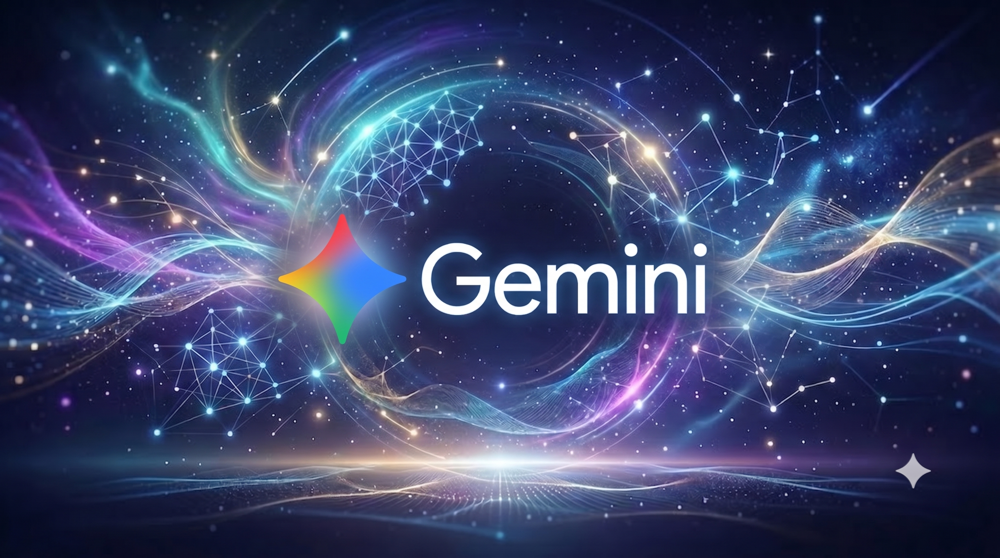
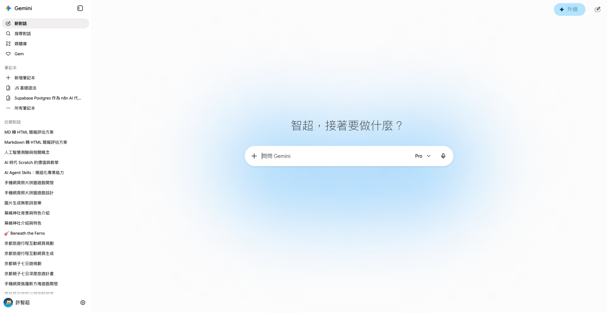
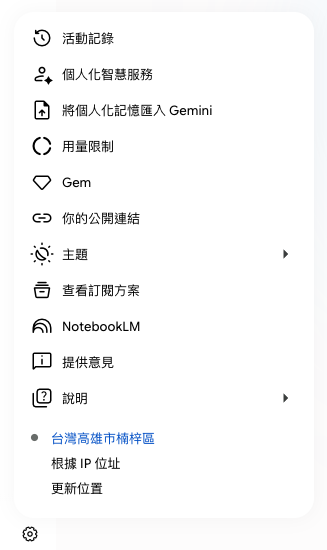
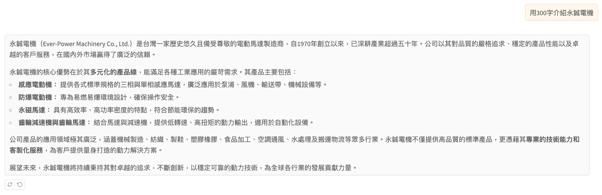
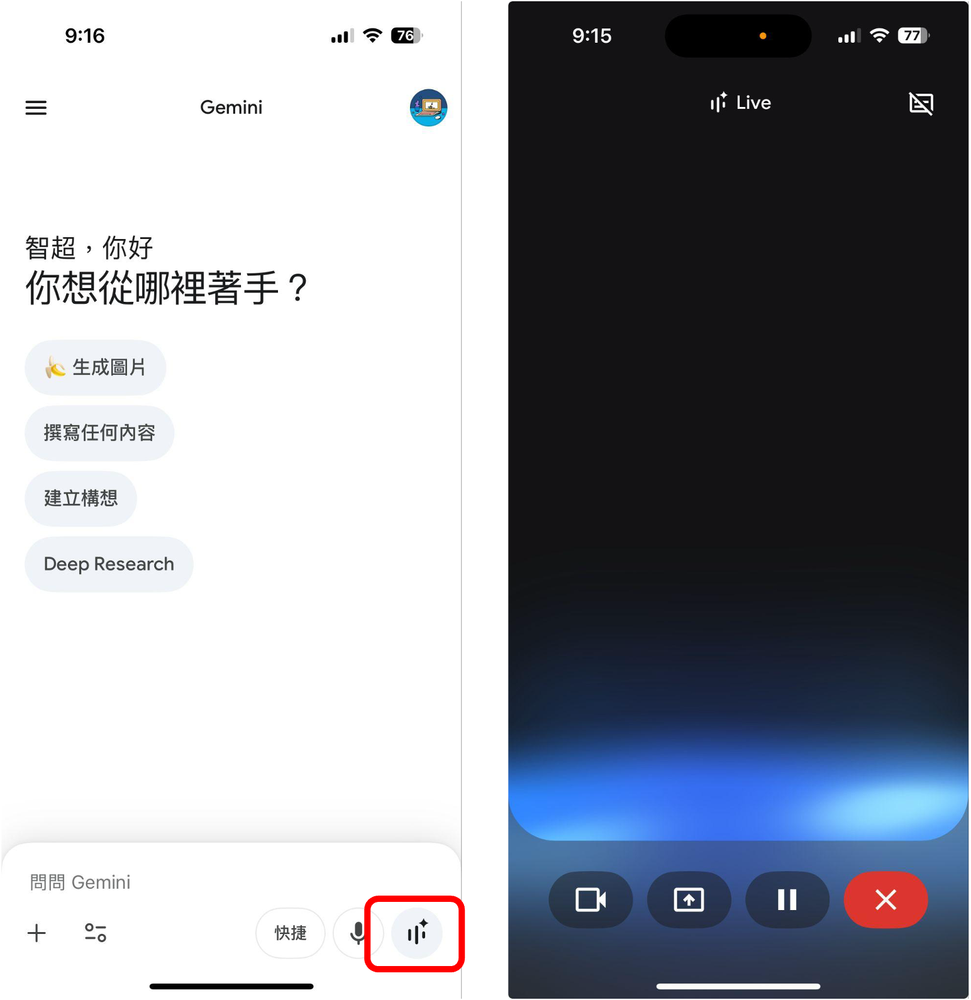
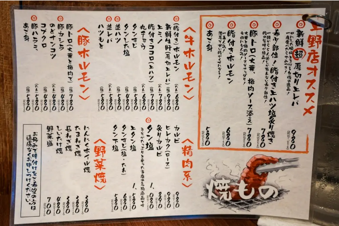

<!-- _class: cover -->
<!-- _paginate: false -->
<!-- _footer: "" -->

# AI及數位化在小型企業流程的應用
## 認識 Gemini

<hr>
許智超

---

<style scoped>
section p { text-align: center; }
</style>

### 簡報


https://reurl.cc/YmlNQD

---

<!-- _class: section-page -->

<span class="num">01</span>

## 什麼是 Gemini？
<hr>

---
<style scoped>
section p, li { font-size: 0.8em; }
</style>

### Gemini
<hr>

Gemini 是 Google 開發的多模態大型語言模型 (LLM)，可處理文字、程式碼、圖片、音訊和影片等資訊。[https://gemini.google.com/](https://gemini.google.com/)
- 核心能力： 具備強大的**多模態**理解和推理能力，能夠同時處理並整合不同媒體格式的輸入。
- 主要優勢： 擅長複雜的推理和規劃，並能生成高品質程式碼。
- 應用整合： 廣泛內建於 Google 搜尋、Android 裝置及 Google Workspace 應用程式中。



---
<style scoped>
section p, li { font-size: 0.8em; }
</style>

### 介面
<hr>

- 左側邊欄（導覽與對話管理）
    - 頂部功能列：包含「新對話」、「搜尋對話」、「媒體庫」和「Gem」等快速連結。
    - 筆記本區塊：建立「新筆記本」，或存取既有專案，顯示了該介面支援結構化的知識管理。
    - 近期對話列表：下方列出了您過去的對話記錄，讓您能快速回顧或繼續之前的討論。
    - 個人資訊：顯示您的個人帳戶名稱及設定。
- 中央對話區（核心互動區域）
    - 輸入框：中央設有主要輸入框，允許您輸入文字進行提問。
    - 模型選擇與工具：輸入框右側標示目前使用的模型，並提供語音輸入圖示，方便您切換模型或選擇輸入方式。
- 右上角圖示
    - 右上角設有「無痕對話」的圖示，讓您以無痕模式進行對話。



---
<style scoped>
section p, li { font-size: 0.8em; }
</style>

### 設定
<hr>

- 個人化與帳戶管理
  - 活動記錄：查看或管理您的對話互動歷程。
  - 個人化智慧服務：針對您的需求優化 AI 體驗。
  - 將個人化記憶匯入 Gemini：讓 AI 能參考與您相關的資訊，提升對話的精確度與連續性。
- 應用與工作流整合
  - Gem：管理或自定義您的專屬 AI 助手。
  - NotebookLM：快速存取該筆記工具，方便處理與研究相關的複雜文件。
  - 你的公開連結：管理您分享出去的對話連結。
- 系統與偏好設定
  - 用量限制：監控您目前使用模型的額度狀況。
  - 主題：可調整介面的顯示外觀。
  - 說明與意見回饋：存取說明中心或是向開發團隊提供使用體驗建議。



---

<!-- _class: section-page -->

<span class="num">02</span>

## Gemini 初體驗
<hr>

---

### 和 Gemini 互動
<hr>

- 什麼是提示詞 (Prompt)？
提示詞是您與 Gemini 互動的主要方式，透過文字輸入，您可以向模型提出問題、請求建議或要求生成內容。
- 要具備什麼能力才能和 Gemini 互動？
會講話就可以了
- 第一個練習：

```
請預測今年世足賽冠軍是哪一隊？
```

<br>

💬 [簡報提示詞庫](https://github.com/chihchao/slides-yongchen/blob/main/slides/02-gemini/prompt.md)

---

<style scoped>
section p { font-size: 0.8em; }
</style>

<!-- _class: lead -->

### 什麼時候延續對話？什麼時候重新開始？


[1999 和信電訊「輕鬆打．愛的選擇」互動式廣告 雙結局完整版](https://www.youtube.com/watch?v=wSkkcxONlls)

---

### 什麼時候要「開啟新對話」？

當你想聊的**主題完全不同**，或者**之前的對話已經嚴重干擾到現在的回答**時，就應該果斷開啟新對話。

* **完全轉換主題：** 剛剛在寫程式，現在想規劃旅遊行程，AI 可能會混入不相關的上下文。
* **進入全新的專案：** 上一個對話是專業簡報，下一個是幽默貼文，語氣與受眾差太多，該開新房間。
* **AI 開始胡言亂語：** 對話拉太長、記憶體快滿，或錯誤糾正不回來時，開新對話最快。

---

### 什麼時候要「延續舊對話」？

當你需要 AI **記住之前的設定、資料或風格**，並在此基礎上繼續發展時。

* **階段性任務與延伸：** 一環扣一環的任務（摘要 → 列重點 → 改大綱），必須在同一對話進行。
* **風格與角色已經定調：** 花時間「調教」出的語氣或角色設定，只要還在同一脈絡就繼續沿用。
* **漸進式修正：** 回答很接近但還差一點，直接說「改口語一點」讓它微調即可。

---

### 快速決策小撇步

| 觀察指標 | 建議做法 |
| --- | --- |
| **主題換了、想聊新的東西** | 🆕 開啟新對話 |
| **AI 開始跳針、怎麼講都聽不懂** | 🆕 開啟新對話 |
| **需要用到前面的資料、程式碼、設定** | 🔄 延續舊對話 |
| **想要對目前的回答進行微調、改寫** | 🔄 延續舊對話 |

---

### 什麼是「上下文」？

**上下文（Context）** 是指 AI 在同一個對話中，能夠參考、記得的所有內容——包含你之前說過的話、提供的資料，以及 AI 自己先前的回答。

- **就像聊天記憶：** AI 會根據這些「前情提要」來理解你現在的問題，而不是每句話都從零開始。
- **有容量上限：** 對話拉得越長，累積的內容越多，一旦超過上限，較早的內容就會被「遺忘」，導致回答開始失準。
- **會被雜訊干擾：** 不相關的主題混進同一段對話，也會污染上下文，讓 AI 的判斷變得不精準。

這就是為什麼「該不該開新對話」如此重要——上下文乾淨，AI 才能給出精準的回答。

---

<!-- _class: lead -->

### Gemini 說得都對嗎？


一本正經的胡說八道

---

### 語言模型大比拼，誰說得最正確？

- Gemini：<https://gemini.google.com>
- ChatGPT：<https://chat.openai.com>
- Claude：<https://claude.ai>
- Perplexity：<https://www.perplexity.ai>
- Grok：<https://grok.com>
- DeepSeek：<https://www.deepseek.com>
- Qwen：<https://chat.qwen.ai>
- Doubao：<https://www.doubao.com>

---

### 語言模型大比拼，誰說得最正確？

參考 [簡報提示詞庫](https://github.com/chihchao/slides-yongchen/blob/main/slides/02-gemini/prompt.md)

- 任務一：語言模型知道冷笑話嗎？
- 任務二：語言模型能規劃旅遊嗎？
- 任務三：語言模型能掌握當下社群語感與文化嗎？
- 任務四：語言模型具有共情能力嗎？
- 任務五：語言模型能高情商溝通與換位思考嗎？

---

<style scoped>
section p { font-size: 0.8em; }
</style>

<!-- _class: lead -->

### 真的只要會講話就可以用 Gemini 嗎？


[非洲灰鸚鵡猛叫阿公吃飯　就怕阿公餓到啦~♥｜三立新聞網SETN.com](https://www.youtube.com/watch?v=OtuKukvy8QU)

---

<!-- _class: lead -->

### 把 Gemini 當成你的個人小助理


---

<style scoped>
section p { text-align: center; }
</style>

### 把 Gemini 當成你的個人小助理


---

<style scoped>
section p { text-align: center; }
</style>

### 把 Gemini 當成你的個人小助理


---

### 提示詞

**提示詞（Prompt）** 是你與 AI 模型（如 Gemini）溝通時所輸入的文字、指令或問題。它是引導 AI 產生特定輸出結果的「鑰匙」。

簡單來說，你可以把 AI 想像成一個博學但需要明確指示的助手，而提示詞就是你給予助手的**具體工作說明書**。

提示詞工程（Prompt Engineering）是指設計、優化和調整提示詞的過程，以確保 AI 能夠理解你的需求並產生最符合期望的回應。

---

### 為什麼提示詞很重要？

提示詞的精確程度，直接決定了 AI 回答的品質。就像在職場中：

* **模糊的指示**（例如：「寫一份報告」）：AI 可能會給出過於籠統、不符合你需求的內容。
* **精確的指示**（例如：「請以專業的語氣，為我寫一份關於 2026 年台灣配電盤市場趨勢的分析報告，重點包含成本效益與未來五年預測，字數控制在 1000 字以內」）：AI 能更精準地提供你真正需要的資訊。

---

### 一個優質的提示詞通常包含哪些元素？

要寫出好的提示詞，建議你可以遵循 **「結構化思維」**，包含以下幾個要素：

1. **角色設定 (Role)**：告訴 AI 它現在是誰。（例如：「你是一位專業的行銷顧問」）
2. **背景資訊 (Context)**：提供必要的背景知識。（例如：「我正在為一家新創咖啡廳規劃社群經營策略」）
3. **具體任務 (Task)**：清楚說明你要做什麼。（例如：「請幫我撰寫三篇 Instagram 的貼文文案」）
4. **格式限制 (Format/Constraints)**：說明你希望輸出的呈現方式。（例如：「請使用條列式呈現，語氣要輕鬆活潑，並附上適合的表情符號」）

---

### 舉例說明

* **普通提示詞**：
> 教我理財。


* **優化後的提示詞**：
> 請扮演一位講話一針見血、但出發點是為我好的『毒舌理財專家』。我月薪 4 萬，但每個月都要喝星巴克、買最新的 3C、去網美餐廳打卡，是典型的『精緻窮』月光族。請狠狠地訓斥我，並給我 3 個痛經絡但絕對有效的『無痛儲蓄痛點策略』。

---

### 看看別人的提示詞怎麼寫


---

### 實用小撇步

* **給予範例**：如果你希望輸出的風格符合特定格式，可以在提示詞中附上一個範例。
* **迭代優化**：如果 AI 第一次給的結果不滿意，不需要重寫整段話，直接對它說「請將語氣調整得更正式一點」或是「請針對第二點補充更多細節」，AI 會根據對話脈絡進行調整。
* **分步驟引導**：對於複雜的任務，可以要求 AI 「請一步一步思考（Chain of Thought）」，這能顯著提升 AI 在邏輯推理或程式開發任務上的精確度。
* **提示詞模板**：把「常用、重複性高」的提示詞寫成一個固定格式，之後只要替換其中的變數（關鍵字/欄位），就能快速套用，不用每次從零開始構思提示詞。（小秘訣：直接編輯提示詞）

---

<!-- _class: lead -->

### 提示詞很難？用魔法打敗魔法


---

<!-- _class: section-page -->

<span class="num">03</span>

## Gemini Live

<hr>

---

<style scoped>
section p { text-align: center }
</style>

### Gemini App 安裝

<br>


---
<style scoped>
section p, li { font-size: 0.8em; }
</style>

### 什麼是 Gemini Live？
<hr>

Gemini Live 是 Gemini App 中的**即時語音對話**功能，讓你像講電話一樣直接和 AI 互動，不必再一字一字打字。

- 即時語音互動：說話後 AI 立即回應，可自然打斷、追問，如同真人對話。
- 分享畫面與鏡頭：開啟手機鏡頭或分享螢幕，Gemini 能「看見」你眼前的東西並即時討論。
- 多語言支援：可用中文提問、切換英文練習口說，適合語言學習與跨語溝通。
- 開啟方式：在 Gemini App 點選對話框旁的「Live」圖示（波形圖示）即可進入。



---

### Gemini Live 能幫你做什麼？
<hr>

- 口語練習與模擬對談：模擬面試、外語會話練習，即時獲得回饋與修正建議。
- 即時視覺協助：對著鏡頭拍攝報表、電路圖、故障設備，請 AI 邊看邊解說或排除問題。
- 腦力激盪與會議助手：開會或思考時用說的方式整理想法，比打字更快、更自然。
- 生活與工作小助理：一邊做事一邊用語音詢問行程、規則、操作步驟，雙手不必離開手邊工作。

---

<!-- _class: section-page -->

<span class="num">04</span>

## Gemini 來畫圖

<hr>

---

<!-- _class: stats -->

### Gemini 的繪圖方式

<hr />

<div class="stat-wrap">
<div class="stat">

#### 以文生圖

根據輸入的文字描述，自動生成一張圖片。
</div>

<div class="stat hi">

#### 以圖生圖

根據給定的圖片，自動生成另一張新的圖片。仍然需要文字描述來指定想要的修改或風格。

</div>

<div class="stat">

#### 以圖生文

根據圖片，自動生成描述文字、故事、說明或其他形式的文字內容。
</div>
</div>

---

<style scoped>
section p, h4 { text-align: center; }
</style>

<!-- _class: quad -->

### 繪圖提示詞

<hr>

<div class="quad-wrap">
<div class="item" >


#### 圖卡用途
做什麼用途？要給誰？
</div>
<div class="item">


#### 視覺風格
插畫？水彩？可愛風？3D？

</div>
<div class="item">


#### 畫面元素
禮物、氣球
花束、人物
燈光、背景

</div>
<div class="item">


#### 構圖方式
橫式？直式？
中心構圖？留白空間？
</div>
</div>

---

### 以文生圖

提示詞請參考 prompt.md

---

<style scoped>
section p { text-align: center; font-size: 0.5em; }
</style>

### 以圖生圖：修復老照片、變彩色、變風格


[張哲生FB貼文](https://www.facebook.com/ZhangZheSheng/posts/40%E5%B9%B4%E5%89%8D%E9%96%8B%E5%B9%95%E4%BD%8D%E6%96%BC%E9%AB%98%E9%9B%84%E5%B8%82%E4%BA%94%E7%A6%8F%E4%BA%8C%E8%B7%AF%E8%88%87%E4%B8%AD%E5%B1%B1%E4%B8%80%E8%B7%AF%E5%8F%A3%E7%9A%84%E8%88%8A%E5%A4%A7%E7%B5%B1%E7%99%BE%E8%B2%A8/10153097296119531/)

---

<!-- _class: stats -->

<div class="stat-wrap">
<div>

#### 修復老照片

提示詞請參考 prompt.md
</div>

<div>

#### 黑白照片變彩色

提示詞請參考 prompt.md
</div>

<div>

#### 變風格

提示詞請參考 prompt.md
</div>
</div>

---

<style scoped>
section p { text-align: center; font-size: 0.5em; }
</style>

### 以圖生圖：換服裝、換背景、換風格


[鄧麗君](https://tcmb.culture.tw/zh-tw/detail?keyword=%E9%84%A7%E9%BA%97%E5%90%9B&limit=24&offset=168&sort=relevance&order=desc&isFuzzyMode=false&query=%7B%7D&indexCode=online_metadata&id=2305084&recOffset=179)

---

<!-- _class: stats -->

<div>

### 換服裝

提示詞請參考 prompt.md

</div>

<div>

### 換背景

提示詞請參考 prompt.md

</div>

<div>

### 換風格

提示詞請參考 prompt.md

</div>

---

<style scoped>
section p { text-align: center; font-size: 0.5em; }
</style>

### 以圖生文：自動生成圖片內容及說明文字


[請問有懂日文的人，可以幫翻譯菜單嗎？](https://www.dcard.tw/f/japan_travel/p/257247851)

---

### 以圖生文：自動生成圖片內容及說明文字

提示詞請參考 prompt.md

---

<!-- _class: section-page -->

## Gemini 作音樂

<hr>

---

### 創作音樂

只要描述你腦中的想像、特定的場景或主題，接著按下傳送，Gemini 就會立刻為你量身打造音樂。
可以指定曲風或樂器。
你也可以上傳照片或影片，Gemini 會分析畫面裡的人物、背景與氛圍，自動創作出一首風格契合的曲子。
Gemini 生成的音樂通常會附帶歌詞與人聲。如果你只需要單純的樂器演奏，記得在指令中特別標註「純音樂」或「不需要歌詞」。


